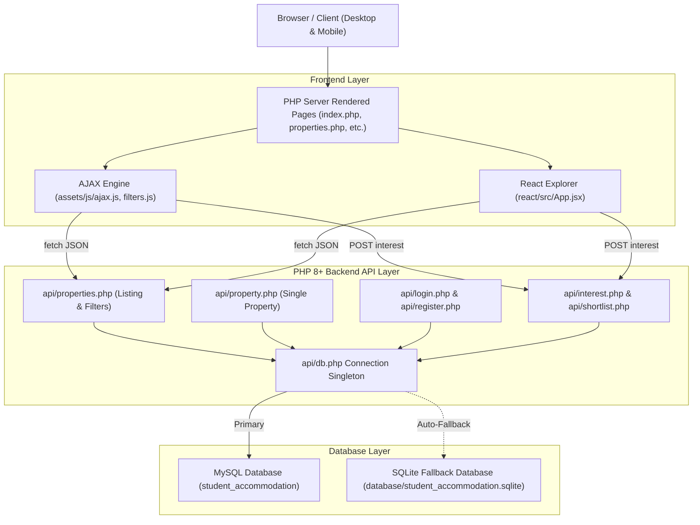
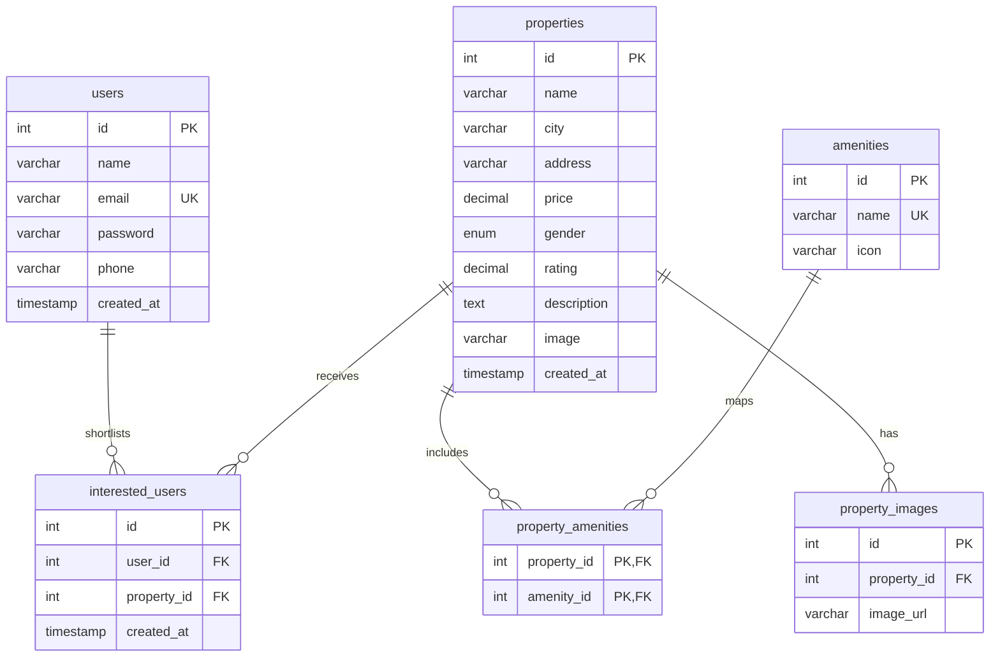

# StayNest - Student Accommodation & PG Booking Platform

> A full-stack, responsive web application for student PG booking and shortlisting, engineered with **HTML5, CSS3, Bootstrap 5, JavaScript ES6+, AJAX (fetch), PHP 8+ (PDO), MySQL, and React**.

---

## 1. Project Overview

**StayNest** is an academic and production-ready student accommodation platform designed to help university students discover, filter, inspect, and shortlist verified PG (Paying Guest) residences and co-living spaces near major educational campuses across India.

### Key Highlights
- **Real-World Experience**: Professional accommodation UI inspired by modern housing platforms like AmberStudent, Stanza Living, and Nestaway.
- **Dual Database Architecture**: Direct MySQL PDO connection with zero-config automatic fallback to SQLite for local development and grading evaluations.
- **No Unnecessary Page Reloads**: Asynchronous property search, multi-criteria filtering, and heart shortlisting powered by vanilla JavaScript `fetch()` and JSON APIs.
- **React Integration**: Dedicated interactive React component tree (`PropertyList -> PropertyFilters, PropertyCard`) built with Vite and integrated directly into the PHP application alongside the native AJAX listing.
- **Security First**: Prepared statements against SQL injection, bcrypt password hashing via `password_hash()`, session authentication, and output sanitization with `htmlspecialchars()`.

---

## 2. Project Objectives

1. Demonstrate full-stack web architecture bridging a PHP 8+ PDO backend with relational MySQL data storage.
2. Implement seamless asynchronous (AJAX) workflows without page reloads for filtering, searching, and user shortlisting.
3. Integrate a modern React single-page component into a multi-page PHP application.
4. Deliver an intuitive, responsive user interface adapted for mobile (320px–425px), tablet (768px), laptop (1024px), and desktop (1440px) displays.

---

## 3. Technology Stack

| Layer | Technology | Purpose |
| :--- | :--- | :--- |
| **Frontend UI** | HTML5, CSS3, Bootstrap 5.3.3 | Semantic structure, custom design system, and responsive grid |
| **Icons & Typography** | Bootstrap Icons 1.11.3, Google Plus Jakarta Sans | Visual clarity, star ratings, and modern typography |
| **Client Scripting** | JavaScript ES6+, `fetch()` API | DOM manipulation, debounced input, and AJAX calls |
| **Component Framework** | React 18, Vite | Property search & filter interactive component |
| **Backend** | PHP 8.3+ (PDO) | RESTful JSON APIs, session authentication, and server-side rendering |
| **Database** | MySQL (with zero-config SQLite fallback) | Normalized relational storage for properties, amenities, and users |
| **Tooling & Server** | Apache (`.htaccess`) / PHP CLI Server | Local development server and production routing |

---

## 4. System Architecture



---

## 5. Database Design & Schema

The database `student_accommodation` is fully normalized (3NF) with foreign key cascade actions and unique constraints.



### Table Definitions
1. `users`: Stores registered students with bcrypt hashed passwords (`password_hash`).
2. `properties`: Stores 15 realistic student residences across Bengaluru, Dharwad, Hubballi, Mysuru, Hyderabad, and Pune.
3. `amenities`: Master list of accommodation amenities (WiFi, AC, Food, Laundry, CCTV, Parking, Power Backup, Study Room, Gym, Housekeeping).
4. `property_amenities`: Junction table mapping properties to their amenities with cascading deletes.
5. `property_images`: Gallery table supporting multiple photos per property.
6. `interested_users`: Shortlist tracking with `UNIQUE(user_id, property_id)` to prevent duplicate interests.

---

## 6. Directory Structure

```
student-accommodation/
├── index.php                 # Landing page (Hero search, featured PGs, about cards, contact)
├── properties.php            # Main listing page with AJAX filtering & React view switcher
├── property-details.php      # Full property view with image gallery, amenities & contact modal
├── login.php                 # User login with demo 1-click accounts
├── register.php              # User registration with password hashing & validation
├── logout.php                # Session destruction and clean redirection
├── shortlist.php             # Protected page displaying user's shortlisted accommodations
├── profile.php               # Protected student profile dashboard
│
├── api/
│   ├── db.php                # Reusable PDO connection (MySQL + auto SQLite fallback)
│   ├── properties.php        # GET: filterable property listings & search
│   ├── property.php          # GET: single property with gallery & amenities
│   ├── login.php             # POST: email/password session authentication
│   ├── register.php          # POST: user creation & validation
│   ├── interest.php          # POST: toggle property shortlist (add/remove)
│   ├── shortlist.php         # GET/DELETE: view and remove user shortlists
│   └── filters.php           # GET: metadata for cities, budget, and amenities
│
├── components/
│   ├── navbar.php            # Bootstrap 5 responsive navbar with live shortlist badge
│   ├── footer.php            # Comprehensive 4-column footer with quick links & social icons
│   └── property-card.php     # Reusable server-rendered property card component
│
├── assets/
│   ├── css/
│   │   └── style.css         # Modern design system (navy/emerald palette, cards, micro-animations)
│   ├── js/
│   │   ├── main.js           # Toast notifications, smooth scroll, contact form handler
│   │   ├── ajax.js           # Shortlist toggle handler & navbar badge synchronizer
│   │   └── filters.js        # Debounced search & multi-filter AJAX controller
│   └── images/               # High quality property photos & gallery items
│
├── react/
│   ├── package.json          # React 18, Vite dependencies
│   ├── vite.config.js        # Vite relative bundle build configuration
│   ├── index.html            # Standalone React development mount
│   ├── dist/                 # Production bundled assets embedded into PHP
│   └── src/
│       ├── main.jsx          # React DOM root initialization
│       ├── App.jsx           # Main React state & API controller
│       └── components/
│           ├── PropertyList.jsx     # Responsive grid with loading skeletons & empty state
│           ├── PropertyCard.jsx     # React card with live shortlist toggle
│           └── PropertyFilters.jsx  # Interactive sidebar filters (City, Budget, Gender, Rating)
│
├── database/
│   ├── student_accommodation.sql     # Ready-to-import MySQL script (Schema + 15 properties)
│   └── student_accommodation.sqlite  # Pre-seeded portable SQLite database
│
├── .env.example              # Environment configuration template
├── .htaccess                 # Apache rewrite, caching, and security headers
└── README.md                 # Complete project documentation
```

---

## 7. Installation & Setup

### Prerequisites
- PHP 8.0 or higher
- MySQL 5.7+ / MariaDB 10.3+ (optional if using built-in SQLite auto-fallback)
- Node.js 18+ and npm (for building the React component)
- Apache / Nginx or the built-in PHP development server

---

### Method A: Running with Built-in PHP Server (Zero-Config, Recommended)

1. Open your terminal in the project root directory:
   ```bash
   cd "student-accommodation"
   ```

2. Start the built-in PHP development server:
   ```bash
   php -S localhost:8000
   ```

3. Open your browser and navigate to:
   ```
   http://localhost:8000
   ```
   *Note: If MySQL is not running on your machine, `api/db.php` automatically connects to the pre-seeded SQLite database so all pages, APIs, authentication, and shortlist features work immediately with zero configuration!*

---

### Method B: Running with XAMPP / WAMP / LAMP (MySQL Setup)

1. **Copy Project to Web Root**:
   - **XAMPP**: Copy the project folder into `C:/xampp/htdocs/student-accommodation`.
   - **WAMP**: Copy into `C:/wamp64/www/student-accommodation`.

2. **Start Apache and MySQL**:
   - Open the XAMPP / WAMP Control Panel and start both **Apache** and **MySQL**.

3. **Import Database**:
   - Open **phpMyAdmin** in your browser (`http://localhost/phpmyadmin`).
   - Click **Import** in the top navigation bar.
   - Choose the file: `database/student_accommodation.sql`.
   - Click **Go / Import**. The database `student_accommodation` and all tables with 15 sample properties will be created automatically.

4. **Verify Database Credentials**:
   - Open `api/db.php`. The default credentials match standard XAMPP settings:
     ```php
     define('DB_HOST', 'localhost');
     define('DB_PORT', '3306');
     define('DB_NAME', 'student_accommodation');
     define('DB_USER', 'root');
     define('DB_PASSWORD', '');
     ```
   - If your MySQL has a password, update `DB_PASSWORD` or set environment variables.

5. **Access the Website**:
   ```
   http://localhost/student-accommodation/
   ```

---

## 8. Building & Running the React Component

The React application resides in `react/`. Its production build is pre-compiled into `react/dist/` and seamlessly integrated into `properties.php?view=react`.

### To Run React in Development Mode:
```bash
cd react
npm install
npm run dev
```
Navigate to `http://localhost:5173`. Vite proxies `/api` calls to `http://localhost:8000`.

### To Re-Build React for PHP Integration:
```bash
cd react
npm run build
```
Vite compiles the bundle directly into `react/dist/assets/index.js` and `react/dist/assets/index.css`, which `properties.php` automatically loads when switching to **React Component** view.

---

## 9. API Endpoints Reference

All API responses are formatted in strict JSON with appropriate HTTP status codes.

### 1. `GET /api/properties.php`
Fetches filterable properties list.
- **Parameters**:
  - `city` (string): `Bengaluru`, `Dharwad`, `Hubballi`, `Mysuru`, `Hyderabad`, `Pune`, or `All`
  - `budget` (string): `under_5000`, `5000_7000`, `7000_10000`, `above_10000`, or `All`
  - `gender` (string): `Male`, `Female`, `Co-living`, or `All`
  - `rating` (float): `0`, `3`, `4`
  - `search` (string): Keyword matching against property name, locality, or description
  - `sort` (string): `price_low`, `price_high`, `rating_high`
- **Sample Response**:
  ```json
  {
    "success": true,
    "count": 15,
    "properties": [
      {
        "id": 1,
        "name": "Student Nest PG",
        "city": "Bengaluru",
        "address": "5th Block, Koramangala, Near Jyoti Nivas College",
        "price": 7500.0,
        "formatted_price": "₹7,500",
        "gender": "Male",
        "rating": 4.6,
        "description": "Premium student residence with high-speed 500Mbps WiFi...",
        "image": "assets/images/property-1.jpg",
        "amenities": [
          { "id": 1, "name": "WiFi", "icon": "bi-wifi" },
          { "id": 3, "name": "Food", "icon": "bi-egg-fried" }
        ],
        "is_interested": false
      }
    ]
  }
  ```

### 2. `GET /api/property.php?id=1`
Fetches complete details, gallery images, amenities, and owner contact details.

### 3. `POST /api/interest.php`
Toggles interest/shortlist state for the authenticated user.
- **Payload**: `{"property_id": 1}`
- **Success Response (Added)**:
  ```json
  {
    "success": true,
    "action": "added",
    "is_interested": true,
    "property_id": 1,
    "shortlist_count": 4,
    "message": "Property added to shortlist!"
  }
  ```
- **Success Response (Removed)**:
  ```json
  {
    "success": true,
    "action": "removed",
    "is_interested": false,
    "property_id": 1,
    "shortlist_count": 3,
    "message": "Property removed from shortlist."
  }
  ```
- **Guest Response (401)**:
  ```json
  {
    "success": false,
    "message": "Please login to shortlist properties.",
    "require_login": true
  }
  ```

### 4. `GET /api/shortlist.php`
Returns all properties shortlisted by the currently logged-in user.

### 5. `DELETE /api/shortlist.php`
Removes a property from the user's shortlist with live count update.

### 6. `POST /api/login.php`
Authenticates email and password, starting PHP session.

### 7. `POST /api/register.php`
Validates and creates a new student user account with bcrypt password hashing.

### 8. `GET /api/filters.php`
Returns metadata of available cities with listing counts, budget ranges, and amenities.

---

## 10. Sample Test Accounts

For quick examiner evaluation and testing, the following accounts are pre-configured:

| Name | Email Address | Password | Sample Data Pre-loaded |
| :--- | :--- | :--- | :--- |
| **Rahul Sharma** | `rahul@student.edu` | `Password123!` | 3 Pre-shortlisted properties in Bengaluru & Hyderabad |
| **Priya Kulkarni** | `priya@student.edu` | `Password123!` | 2 Pre-shortlisted properties in Mysuru & Pune |

*You can also click the **Quick 1-Click Demo Accounts** buttons directly on `login.php`.*

---

## 11. Security Implementation

1. **SQL Injection Prevention**: All queries use **PDO prepared statements** with parameter binding (`?` placeholders).
2. **Password Hashing**: Passwords are encrypted using PHP `password_hash($password, PASSWORD_BCRYPT)` and verified with `password_verify()`. No plain-text passwords exist in the database.
3. **Cross-Site Scripting (XSS) Mitigation**: All user and dynamic database output rendered in HTML is sanitized using `htmlspecialchars()`.
4. **Session Security**: Sessions are regenerated upon login, cookies are strictly flagged, and unauthorized access to `/shortlist.php` and `/profile.php` automatically redirects to `login.php`.
5. **Apache Hardening**: `.htaccess` includes security headers (`X-Frame-Options`, `X-Content-Type-Options`, `X-XSS-Protection`) and restricts direct access to `.env` and `.sqlite` files.

---

## 12. Deployment Guide

### Deploying to Shared Hosting (cPanel / Apache / PHP 8)
1. Export or upload the MySQL script `database/student_accommodation.sql` via **cPanel phpMyAdmin**.
2. Upload the project files to `public_html/`.
3. Create a `.env` file or update `api/db.php` with your cPanel database name, user, and password.
4. Ensure `assets/` and `react/dist/` permissions are set to `755` for directories and `644` for files.

### Deploying to Linux VPS (Ubuntu / Nginx / Apache)
1. Install PHP 8.2+ and extensions: `sudo apt install php php-mysql php-sqlite3 php-mbstring php-curl`.
2. Configure Apache VirtualHost or Nginx server block pointing root to the project directory.
3. Import the SQL schema: `mysql -u root -p student_accommodation < database/student_accommodation.sql`.

---

## 13. Future Enhancements

1. **Payment Gateway Integration**: Direct booking token deposit via Razorpay / Stripe.
2. **Roommate Matching**: Algorithmic compatibility scoring based on college, study habits, and sleep schedules.
3. **Interactive Campus Maps**: Integrated Google Maps Platform showing walking and cycling distance to universities.
4. **Real-time Landlord Chat**: WebSockets messaging between students and accommodation caretakers.

---

## 14. Repository & Project Links

- **Live Project URL**: `[Add after deployment]`
- **GitHub Repository**: [https://github.com/shetty658/student-accommodation](https://github.com/shetty658/student-accommodation)
- **Author**: AKSHAN SHETTY ([@shetty658](https://github.com/shetty658))
- **License**: MIT License © 2026 StayNest. All rights reserved.
